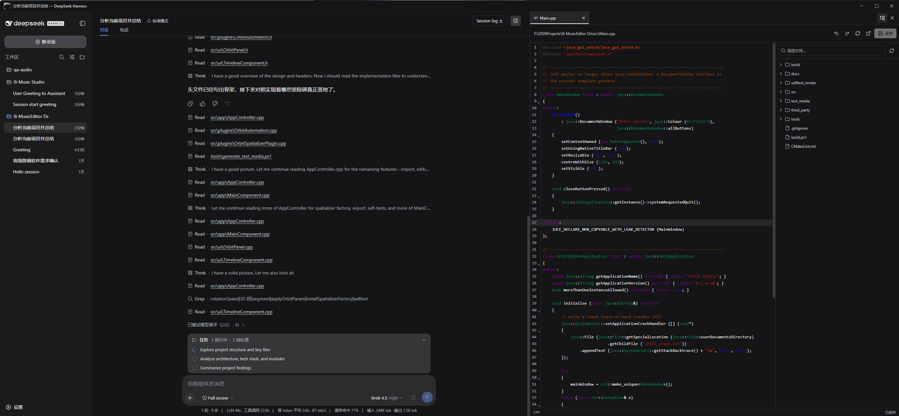

# oi-dsh-desktop

[中文说明](./README.zh.md)

Windows Electron client installer for a DeepSeek Harness source checkout.

The installer extends the Harness source composition and builds a packaged desktop application. The Harness Host runs inside Electron's main process and the renderer connects over process-local IPC. It does not run `dsh web`, open port 3080, or wrap a browser URL.

## Preview



## Requirements

- Windows 10 or Windows 11 x64
- Node.js 22.19.0 or newer, with npm
- Git

The installer carries its own pinned pnpm version. A global pnpm install is not required.
It checks whether the desktop extension applies cleanly to the current Harness source and stops without modifying files when the source is incompatible.

## Install

Clone this repository directly inside the Harness source root:

```powershell
git clone https://github.com/deepseek-ai/deepseek-harness.git
cd deepseek-harness
git clone https://github.com/oioioioioioioioioioio/oi-dsh-desktop.git
cd oi-dsh-desktop
.\install.cmd
```

The generated application is:

```text
deepseek-harness\dist\oi-dsh-desktop-win32-x64\oi-dsh-desktop.exe
```

Launch that executable directly after installation. Do not run `npx @deepseek-ai/dsh web`; that command starts the official browser deployment.

## Upgrade

Close the client, then run inside the existing `oi-dsh-desktop` directory:

```powershell
git pull
.\install.cmd
```

The installer recognizes supported older extensions, migrates the Harness source in place, and rebuilds the EXE. Recloning Harness is not required.

## What setup does

1. Installs `oi-dsh-desktop` and `oi-dsh-desktop-bundle`.
2. Applies the Electron IPC, file workbench, and three-column source extension to Harness.
3. Installs Harness dependencies with the pinned pnpm release.
4. Builds the isolated production Electron runtime.
5. Packages a directly launchable Windows application.

## Features

- Process-local Electron IPC with no Harness HTTP or WebSocket listener.
- Custom native-style title bar and complete native window behavior.
- Multiple workspaces and sessions.
- Toggleable, unrestricted-width project explorer and file workbench.
- Multi-tab CodeMirror editor with syntax highlighting, undo, redo, reload, and save.
- Markdown source, preview, and split modes.
- Workspace-confined, version-guarded file operations.
- Native folder picker and session export.

## Commands

```powershell
npm run install:harness
npm run build:exe
npm run setup
npm start
```

## License

Apache-2.0. The extended DeepSeek Harness source remains under its MIT license.
